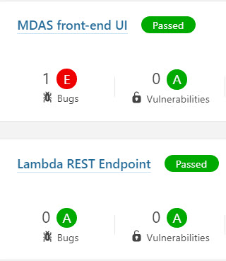

***Guidehouse, LLP, Data Universal Numbering System (DUNS): 079529872, Solicitation Number #: 70SBUR19Q00000066, Shannon White, Partner, 1800 Tysons Boulevard, 7th Floor, McLean, VA 22102-4257, Telephone: (571) 296-2571, Email: swhite@guidehouse.com***

------

Team Guidehouse ran security SonarQube scans with an OWASP Top 10 policy setting throughout the duration of the Technical Challenge. When a developer opened a pull request, our SonarQube ran a UI scan and/or a container scan. Below is an image of our scan results:

------

1