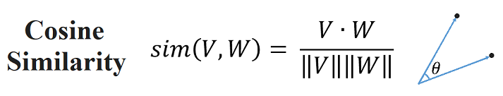
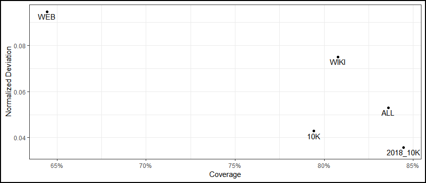

# Models.md #
#### Introduction
This document provides users with the information and instructions needed to operate and maintain the AlphaTaxonomy model, our solution to the problem of sector and industry classification of companies traded on the three major U.S. financial securities exchanges: NYSE, NASDAQ, and AMEX

Our model architecture provides users with the capability to:
•	Automatically ingest and pre-process source data without human intervention
•	Run the AlphaTaxonomy AI/ML models over microservices at scale
•	Explore the results of model runs through our solution user interface (UI). 

## Data Ingestion

#### Our Sources
Our solution's web scraping engine ingests raw text data from a companies' U.S. SEC 10-K filings, websites, and Wikipedia pages. Our ingestion model achieves an exceptional overall coverage of 98% of all companies traded on the three major U.S. exchanges; many of the tickers omitted correspond to publicly traded funds (iShare ETFs, Vanguard ETFs, etc.), which are not of direct interest in the present investigation of sector and industry classification.

|Data Source|Source Description|Company Coverage (%)|
| -------------------------------------- | ------------------------------------------ | -------------- |
|U.S. SEC 10-K Filings|The SEC maintains a database called EDGAR which stores information on a company’s public financial filings. The 10K filings are reports about a company’s financial situation and include descriptions of the company and the type of goods or services they provide.|79.0|
|Company Websites|Data from the websites of companies is also scraped. Information gained from the web that is included in the modeling and analysis includes a basic description and keywords used for indexing of a website.|57.2|
|Wikipedia|Web scraping is performed on Wikipedia to find and extract the short description and long description of all listed companies.|41.7|
|All Sources|Text sources are cleaned and collated to provide a holistic picture of each company.|98.0|

#### Retrieving Data Sources
The full data set scraped for all companies is large (~7000 tickers) but our ETL architecture is parallelized with AWS Lambda so the data can be retrieved much more quickly (full runtime ~ 1 hour). Our ETL is also fully automated and can be configured to retrieve source data using a scheduler, via an AWS Lambda conditional trigger, or manually by a user running a single command in the AWS Console. 

## AlphaTaxonomy

#### Text Pre-Processing
The AlphaTaxonomy model ingests unstructured text data and uses a Natural Language Processing (NLP) algorithm called Doc2Vec to learn the patterns of words (topics) that best characterize the input documents. Thoughtful text pre-processing greatly improves the performance of the Doc2Vec algorithm. By removing extraneous text we provide Doc2Vec with a signal that has been clarified of noise, giving the algorithm a basis to detect underlying patterns. 

AlphaTaxonomy text pre-processing steps:
–	Removal of Special Characters and non UTF-8
–	Removal of stop words using Python NLTK dictionary of common English words
–	Part of Speech (POS) tokenization using Python NLTK tokenization algorithms
–	Removal of proper nouns, adverbs, and prepositions from tokenized corpus

These pre-processing steps have been coded in Python and deployed to the solution environment. To run the text pre-processing use the Jupyter notebook, as referenced in the table in the section on Maintenance Roles, later in this document.

#### NLP: Document Embedding (Doc2Vec)
We use the Gensim implementation in Python of the document modelling algorithm Doc2Vec (https://arxiv.org/abs/1507.07998). Doc2Vec is an unsupervised machine learning method that uses shallow neural networks to map words, paragraphs, and documents to vectors in a high-dimensional vector space. Though highly abstract, these vector representations of our input documents are also immensely useful and they encode information about features of the sampled text (i.e., the existence, frequency, and co-occurrence of words within sentences, paragraphs, and documents). 

We can compare the vectors rendered by Doc2Vec through vector operations like cosine similarity, which is analogous to asking if two samples of text are similar to one another within the context of the corpus of training documents. 

	

Due to this property of Doc2Vec's output vectors we are able to determine which documents (companies) are most similar to one another. Our input documents are collations of companies' 10-K filings, website text, and/or Wikipedia pages and were sourced specifically to provide a holistic view of companies. 

A major advantage of using an unsupervised NLP approach is that we do not require labeled training data for our model to learn the features that are associated with specific sectors and industries. The features are extracted from the input text based solely on the algorithm’s expert ability to identify patterns in natural language. Thus, not only can our model can handle unstructured data from the web, it can also adapt as sources change and improve as new text sources are incorporated. 

## AI/ML Hierarchical Clustering
The set of embedded document vectors from Doc2Vec is passed to the next phase of our AlphaTaxonomy model: Hierarchical Clustering. 

Hierarchical clustering is an unsupervised machine learning technique that groups objects that share similar characteristics and separate those with dissimilarities. Applied to our vectors, the clustering algorithm iteratively group vectors that are close together. For this implementation we use Ward's Hierarchical clustering, implemented in Python (scipy). 

One key feature of this model is that the hierarchical relationships between elements in the clusters are maintained even as the target number of clusters changes, for example from 10 to 100 as seen in the dendogram plot, below. 

	

This hierarchical structure is advantageous for use in an ICS because it ensures that all of the members of a given industry will also be members of the same sector. For example, all companies clustered in industry "Agricultural Production Crops", will all end up in the same sector "Agriculture", and never in separate sector clusters (e.g., some in sector "Agriculture", some in sector "Manufacturing"). 

## Model Validation

#### Evaluation Metrics
In evaluating the model outputs, we compared two metrics: coverage and normalized deviation of sector sizes. A sector's coverage is defined as the number of companies in the top 2 most popular Standard Industrial Classification sectors per each sector, and a model output's coverage is the weighted average of the 10 sectors' coverage. We want similar companies to be grouped into the same sectors, so the greater coverage is better. Normalized deviation of sector sizes is defined as the standard deviation of the size of the 10 sectors normalized by the total number of companies. We want sectors to be evenly sized, so lower the normalized deviation the better.

As seen in the plot below, comparing these two metrics among the different runs, we determined the run with 2018 10K as the best input.

	

#### Interpretability
From the vector space embedding we are also able to extract the “top words” associated with each cluster. The table below helps add interpretability to our model, and helps to suggest trends that may be linking the companies in each sector.

|Sector 1 |Sector 2|  Sector 3|  Sector 4|  Sector 5|
|-------- |-------- |-------- |-------- |-------- |
| PHARMACEUTICAL PREPARATIONS | CRUDE PETROLEUM & NATURAL GAS |  CUTLERY HANDTOOLS & GENERAL HARDWARE | SEMICONDUCTORS & RELATED DEVICES | STATE COMMERCIAL BANKS|
| BIOLOGICAL PRODUCTS (NO DISGNOSTIC SUBSTANCES)|  ELECTRIC SERVICES   |MOTOR VEHICLE PARTS & ACCESSORIES|   MOTOR VEHICLE PARTS & ACCESSORIES|   NATIONAL COMMERCIAL BANKS|
| SURGICAL & MEDICAL INSTRUMENTS & APPARATUS   |OIL & GAS FIELD SERVICES| ELECTRONIC CON TORS|  PRINTED CIRCUIT BOARDS|  SAVINGS INSTITUTION FEDERALLY CHARTERED|

|Sector 6 |Sector 7|  Sector 8|  Sector 9|  Sector 10|
|-------- |-------- |-------- |-------- |-------- |
|  REAL ESTATE INVESTMENT TRUSTS|   RETAIL-EATING PLACES|  SERVICES-PREPACKAGED SOFTWARE|   REAL ESTATE INVESTMENT TRUSTS|   REAL ESTATE INVESTMENT TRUSTS|
|  HOTELS & MOTELS|   RETAIL-AUTO DEALERS & GASOLINE STATIONS|   SERVICES-COMPUTER PROCESSING & DATA PREPARATION   |SERVICES-HOME HEALTH CARE SERVICES|  SERVICES-BUSINESS SERVICES|
| OPERATIVE BUILDERS|   RETAIL-FAMILY CLOTHING STORES|   SERVICES-BUSINESS SERVICES|  SERVICES-SPECIALTY OUTPATIENT FACILITIES|  INVESTMENT ADVICE|

## Operations & Maintenance (O&M)

#### Maintenance Roles
There are two core O&M roles for the AlphaTaxonomy Solution Architecture. The Data Scientist handles all tasks related to the ingestion, cleaning, and modeling of data. The Data Architect is responsible for maintaining the integrations with the CI/CD pipeline to ensure peak performance. 

Here is a summary of the responsibilities for each role and the resources available to support each responsibility: 

|Role| Responsibility|
|----|--------------|
|Data Scientist| Schedule/Run Web Scraping & Source Data Updates Run Text Pre-Processing/Model Setup Run AlphaTaxonomy Classification Model Analyze Companies, Sectors, and Industries|
|Data Architect|Deploy & Manage AWS Solution Environment|Scale the Architecture for Volume/Runtime Requirements|Run System Diagnostics/Performance Assessment|Check System Logs, Audit Data Trail, Run Security Scans|

## CI/CD Pipeline Integration

#### Maintenance
Our AI/ML models were developed and coded in the python programming language. This code is integrated and maintained within our CI/CD pipeline referenced in README.md. Model code is picked up by the pipeline when checked in and automatically run in a parallel containerized ML environment. The build tests the outputs of this code and flags any anomalies in the Sonarqube reports. See solutions diagram: Deliverables/References/at-single-level-architecture-diagram.png

#### Solution Integration Points
Maintainers of the AlphaTaxonomy models and architecture should be aware of the following information about integration points between solution components:

|AlphaTaxonomy Model Component|  CI/CD Pipeline Component|  Integration Point Details|
|----|--------------|------------|
|Data Collection, API Download, Web Scraping| R-Containers, OpenShift, S3|- Collection of 10k scripts  - Deliverables/SourceCode/Data libraries/CollectionOf10KScript.R - Deliverables/SourceCode/Data-libraries/Package/StockGuide/mdasNotebook.md - Deliverables/SourceCode/Data-libraries/Wiki_Web_10K_DataConsolidationScript_ForS3.R - Web-Scraping Tool (.py) [GitHub File]|
|Text Pre-Processing | Python ML on OpenShift Containers, S3, Lambda, Sagemaker   |- Data Cleaning Tool (.py) [ GitHub File] - Text Pre-Processing Command [Jupytner Notebook]|
|NLP: Document Embedding (Doc2Vec)|  Python ML on OpenShift Containers, S3, Lambda, Sagemaker   |- AlphaTaxonomy Calssification Tool (.py) [GitHub File]  - Model Flight Check/Run Commands [Jupytner Notebook]|
|AI/ML: Hierarchical Clustering, Naming, Validation| Python ML on OpenShift Containers, S3, Lambda, Sagemaker|   - Visualization/UI Tool [Link to AlphyTaxonomy UI] - Write/Export Results [Jupyter Notebook + AWS File Location]|
|Data Storage/ETL |AWS S3 Storage, AWS Glue, Spark, Lambda|  - An AWS Lambda function triggers AWS Glue to ingest data when new files arrive - An AWS API Gateway populated with more Lambda functions make the data available to the front end UI on demand - Deliverables/SourceCode/Data-api/lambda-json-rest/functions/|
|Audit Logs |AWS S3 Storage|   - Detailed logs can be found at: https://console.aws.amazon.com/cloudwatch/home?region=us-east-1#logs: |

