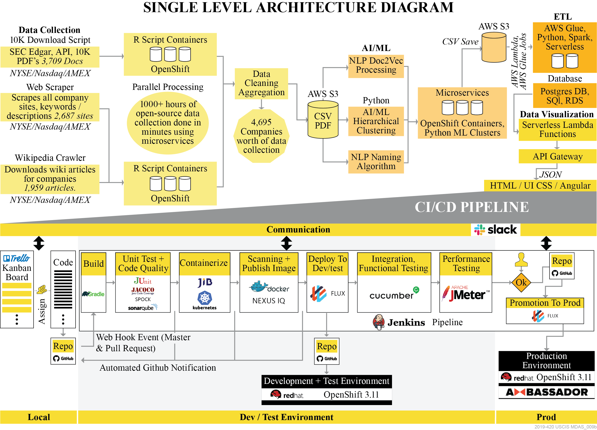

Guidehouse, LLP, Data Universal Numbering System (DUNS): 079529872, Solicitation Number #: 70SBUR19Q00000066, Shannon White, Partner, 1800 Tysons Boulevard, 7th Floor, McLean, VA 22102-4257, Telephone: (571) 296-2571, Email: swhite@guidehouse.com

## Overview
Alpha Taxonomy (AT) is an end to end cloud based, open source Artificial Intelligence and Machine Learning (AI/ML) analysis solution that uses open source data sources to automatically categorize companies into 10 distinct sectors and 100 industries.

## AT Project Files:
All project files are located in the above GitHub directories. The below diagram shows the locations and contents of the files:

|Location|Contents|
|---|---|
|[508](https://github.com/gh-mdas/Deliverables/tree/master/508)|Folder containing all 508 scan information|
|[Documentation](https://github.com/gh-mdas/Deliverables/tree/master/Documentation)|Folder containing all additional documentation<br>Also contains static html version of Jupyter data science notebook|
|[Models](https://github.com/gh-mdas/Deliverables/tree/master/Models)|__Deliverable__ folder containing Models.md and supporting documentation<br>Provides details and links regarding Data Collection, AI/ML, and Integration|
|[References](https://github.com/gh-mdas/Deliverables/tree/master/References)|Folder containing an referenced files/images|
|[SourceCode](https://github.com/gh-mdas/Deliverables/tree/master/SourceCode)|Contains all source code for UI, Data Libraries, APIs, and Infrastructure deployment|
|[Commits.pdf](https://github.com/gh-mdas/Deliverables/blob/master/Commits.pdf)|__Deliverable__ pdf file of all git commits from repos|
|[Scans.md](https://github.com/gh-mdas/Deliverables/blob/master/Scans.md)|__Deliverable__ of scan results (1000 characters)|
|[Solution.pdf](https://github.com/gh-mdas/Deliverables/blob/master/Solution.pdf)|__Deliverable__ pdf of solutions documentation (10 pages max)|
|[UserStories.pdf](https://github.com/gh-mdas/Deliverables/blob/master/UserStories.pdf)|__Deliverable__ pdf describing all project User Stories|
|[Approach.md](https://github.com/gh-mdas/Deliverables/blob/master/Approach.md)|__Deliverable__ describes technical and Agile project approach (5000 characters)|

## How to Setup and Launch Alpha Taxonomy:
This script provisions an AWS environment from a fresh AWS account. As such it makes some assumptions about the state of the account. Given the service limits on new accounts there are restrictions on the number and size of instances for services that we can spin up such as nothing larger than ml.t2.medium for SageMaker etc. You will also require a linux environment with the following dependencies installed:

* [Git](https://www.atlassian.com/git/tutorials/install-git#linux)
* [AWS CLI](https://docs.aws.amazon.com/cli/latest/userguide/install-bundle.html)
* [Terraform 0.11.14](https://releases.hashicorp.com/terraform/0.11.14/)
* printf
* zip
* unzip

Run the below commands within a bash shell or linux terminal. Enter GitHub credentials that were emailed with submission when prompted:

```
git clone https://github.com/gh-mdas/Deliverables.git ; cd Deliverables/SourceCode/Infrastructure/terraform
AWS_ACCESS_KEY_ID=somekey1 AWS_SECRET_ACCESS_KEY=somekey2 ./deployment.sh start
```

Usage: This script takes a single argument with four options ex. ./deployment start

*__Start__: the recommended option, runs the quick start and sets up the environment and prints out all the useful resource endpoints*

*__Start_long__: completely redoes all the data involved in the whole process, which given the size limitations on the instances takes quite some time to complete.*

*__Destroy__: completely tears down all infrastructure stood up with this script as well as does cleanup of buckets to help terraform destroy easier, occasionally terraform does get stuck so running destroy again should fix it*

*__Help__: where you are now, displays the arguments to the script and some information*

## Additional Quick Links
For convenience we have also provided the following pre-deployed links to evaluate our solution:

**Infinity Scroll Sector/Industry/Company Visualization** – http://alphataxonomy.com

*The following links require using the AWS credentials included in the challenge submission e-mail.*

[Live Data Science Jupyter Notebook](https://mdas-data-science.notebook.us-east-1.sagemaker.aws/notebooks/data-science-notebook/NLP%20Pipeline%20Notebook.ipynb)

[Raw Data Files and AI/ML Output](https://s3.console.aws.amazon.com/s3/buckets/at-mdas-data/?region=us-east-1&tab=overview)

[Models](https://github.com/gh-mdas/Deliverables/blob/master/Models/Models.md)

## Solution Description
Alpha Taxonomy’s solution consists of five main components:

|Component|Explanations|
|--------------|----------------|
|Data Collection|	A fully automated system that leverages APIs and web scrapers to continuously pull both current and historical company data from a variety of sources (SEC 10K filings, corporate web sites, Wikipedia, Yahoo Finance). The data collection stack is built on the R programming language and implemented on our DevSecOps microservice architecture.|
|AI/ML|	A suite of AI/ML models consisting of NLP and unsupervised learning algorithms that work together to clean and process all incoming unstructured text data and categorize companies into sectors and industries with no human intervention. These python based models run automatically when new data is ingested and run in parallel over a scalable microservice architecture. An interactive Jupyter notebook enables data scientists to view, understand, and customize the AI/ML process.|
|Extract Transform Load (ETL)|	Our ETL architecture is fully automated, and can be configured to retrieve, transform, and load source data into a new data model using a scheduler, via an AWS Lambda conditional trigger, or manually by a user running a single command in the AWS Console. The ETL architecture is also parallelized with AWS Glue, running as a serverless Spark service and leveraging Lambda for data to be retrieved quickly. The user interface is delivered entirely on a serverless architecture with AWS Lambda and API Gateway providing backend JSON API’s to deliver data to the front-end.|
|Data Visualization|	A custom infinite scroll infographic enables visualization and interaction with the new sector and industry classifications as well as understanding of weightings and metrics for each company. Built on open source Angular.js, HTML/CSS3, and a completely serverless backend, our web application is infinitely customizable, scalable, and resilient up to 99.9999%. Data is automatically provisioned and served to the front-end via a combination of AWS Lambda functions, API Gateway, and AJAX javascript commands. Our open-source custom UI is built on Angular.js and provides interactive real-time data widgets in an infinite scroll UI. |
|DevSecOps Microservice Architecture|	The underlying fabric of the AT solution is a cloud based DevSecOps environment that leverages both misroservice and serverless architectures into one seamless one-click solution. This layer also includes a full CI/CD pipeline to continuously build, test, and deploy code.|


## Hierarchy List of Core Technologies

|Data/AI/ML|	Storage/ETL	|API/Visualization	|DevSecOps|	Collaboration|
|---------|---------|---------|---------|---------|
|R Language|	AWS S3|	AWS API Gateway|	Docker|	Trello|
|Python Language	|AWS Glue|	AWS Lambda	|OpenShift	|Slack|
|Doc2Vec (Gensim)|	Apache Spark|	Node.js|	Terraform	|GitHub|
|AWS Sagemaker|	Amazon RDS|	HTML5/CSS3|	Jenkins||
|Jupyter Notebook|	PostgreSQL	|Angular.js|	Sonarqube||
|Scipy/NLTK/Sklearn|		|Route 53|	Kubernetes||
|			|||Amazon VPC	|





## Solution Considerations

Our solution is built on an architecture that __delivers scalability, security and maintainability__ through the use of security-first principles, monitoring and notifications of vulnerabilities through Nexus IQ Sonatype, fully automated testing, and a scalable platform that’s built using a tool suite that’s similar to the technical landscape at USCIS. Our solution relies on a Lean Agile software development approach to deliver scalability and quality through automation, as highlighted in the single architecture diagram depicted above. We focused on DevSecOps integration within the pipeline to accelerate delivery of new functionality and provide information radiators to drive measurable outcomes. 

Security-First is a key principle of our DevSecOps pipeline, shifting left the involvement of the developer in the security implementation of the product code. Since most of the technical stack is based on open source and to inform risk-based decision on libraries, providing security situational awareness is necessary. Integrating Nexus IQ into the developer IDEs controls the use of libraries, that only viable open source products are incorporated into the code base. Regarding maintainability of our solution, we selected AWS S3 for its fault tolerance and redundancy and we are deploying on a scalable microservice platform. As the solution expands we can continue deploying independently deployable units so that if one fails it won’t affect the entire system.

Our Pull Request (PR) process is automated through Jenkins, conducts initial unit testing, provides static code scanning, and enforces the use of enterprise standards and open source libraries free from security vulnerabilities. Once complete, Jenkins delivers the verified (security and quality tested) build to the Code Review Process, which minimizes pipeline process time by removing redundant activities. Once the Code Review accepts the build, Jenkins merges it into the master and initiates the master pipeline, where full automated testing and container scanning are performed before Blue-Green deployment.

We built a CI pipeline that leverages Docker as a first-class citizen, with Jenkins running as a container on an AWS infrastructure. This pipeline is comprised entirely of container images, optimized to execute a single stage in the pipeline. This allows our pipeline code to remain language agnostic and support any toolchain, framework, or version desired by developers, without increasing the complexity of our Jenkins infrastructure. This empowered our development team to take more ownership over their DevSecOps pipelines and minimize overhead and burden. We used SonarQube to provide quality metrics for both compliance and visualization of code coverage and technical debt. Along with the automated pipeline, developers utilized integrated development environment (IDE) plugins to receive immediate feedback from SonarQube on code quality, while the Nexus IQ Server provided comprehensive security analysis of third party open source binaries.  The continuous delivery (CD) process employed release automation using immutable infrastructure, through Linux containers running on the RedHat Open Shift Kubernetes platform.
